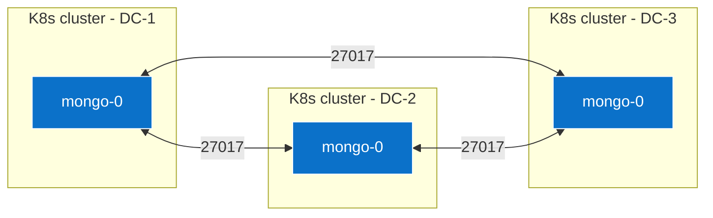

Below is a battle-tested pattern we have used for customer builds that needed a **3-member MongoDB replica-set stretched across three independent Kubernetes clusters / data-centers**, yet managed only with the Bitnami `mongodb` Helm chart.

---

## 0.  What you must have in place first

| Capability                                                                                                                                                    | Why you need it |
| ------------------------------------------------------------------------------------------------------------------------------------------------------------- | --------------- |
| **Flat routable network or VPN between all DCs** on TCP 27017/27018 so the members can heartbeat and elect a primary.                                         |                 |
| **DNS names (or static LB IPs) that resolve cross-cluster** – e.g. `mdb-dc1.example.com`, `mdb-dc2.example.com`, `mdb-dc3.example.com`.                       |                 |
| **A shared Kubernetes `Secret`** that contains the replica-set key file and the same root/monitoring users for *all* clusters (copy once, re-use everywhere). |                 |
| **StorageClass per cluster** that provides fast, durable PVs (RWO is fine; Mongo replicates itself).                                                          |                 |
| **Outbound LB or NodePort** service type available in each cluster (Bitnami’s `externalAccess` feature will build one service *per* Mongo pod).               |                 |

*(The multi-site prerequisites are explained in the design doc you uploaded) ([Artifact Hub][1])*

---

## 1.  Generate the “shared” secret once

```bash
# Context = any one cluster
helm show values oci://registry-1.docker.io/bitnamicharts/mongodb > base-values.yaml
openssl rand -base64 756 > replicaset.key     # the keyFile all members share
kubectl create secret generic mongo-shared-auth \
  --from-literal=replicaSetKey="$(<replicaset.key)" \
  --from-literal=mongodb-root-password='Str0ng!RootP@ss' \
  --from-literal=mongodb-password='svcPass' \
  -n mongodb
```

Export that secret and apply it into the `mongodb` namespace of the other two clusters:

```bash
kubectl get secret mongo-shared-auth -n mongodb -o yaml \
 | kubectl apply --context <cluster-2> -f -
```

---

## 2.  Helm `values.yaml` for **each** cluster

Only **three** fields change per site (LB IP / hostname, pod priority).
Everything else is identical – that is what gives you a clean GitOps repo.

```yaml
# common-values.yaml  (checked-in once)
architecture: replicaset          # one pod per cluster, but still a legit RS
replicaCount: 1                   # 1 pod here – the other two live elsewhere
auth:
  enabled: true
  existingSecret: mongo-shared-auth
  username: svcuser
  database: appdb
replicaSetName: rs-global
externalAccess:
  enabled: true
  service:
    type: LoadBalancer            # or NodePort if no LB
    port: 27017
  autoDiscovery:
    enabled: true                 # container will call rs.add() for us
persistence:
  storageClass: fast-nvme
  size: 20Gi
```

Now overlay the three site-specific bits:

```yaml
# dc-1.yaml
externalAccess:
  service:
    loadBalancerIPs: ["10.10.1.100"]   # or omit to let the cloud assign
podPriorityClassName: mongo-site-a     # optional: influences primary bias
podLabels:
  topology.kubernetes.io/region: dc1
---
# dc-2.yaml
externalAccess:
  service:
    loadBalancerIPs: ["10.20.2.100"]
podPriorityClassName: mongo-site-b
podLabels:
  topology.kubernetes.io/region: dc2
---
# dc-3.yaml
externalAccess:
  service:
    loadBalancerIPs: ["10.30.3.100"]
podPriorityClassName: mongo-site-c
podLabels:
  topology.kubernetes.io/region: dc3
```

---

## 3.  Install one member **per cluster**

```bash
# DC-1 (first member becomes PRIMARY)
helm install mongo bitnami/mongodb -n mongodb \
  -f common-values.yaml -f dc-1.yaml

# DC-2
helm install mongo bitnami/mongodb -n mongodb \
  -f common-values.yaml -f dc-2.yaml

# DC-3
helm install mongo bitnami/mongodb -n mongodb \
  -f common-values.yaml -f dc-3.yaml
```

Because `externalAccess.autoDiscovery.enabled=true`, each pod’s **init** container waits until it can reach the other two LB endpoints, then automatically executes:

```js
rs.initiate()                // first pod only
rs.add("mdb-dc2.example.com")// subsequent pods
rs.add("mdb-dc3.example.com")
```

*(That behaviour is built into the Bitnami chart) *

> **Tip:** If your firewalls delay LB allocation, set
> `externalAccess.predefinedExternalAddress` instead of relying on autodiscovery.

---

## 4.  Verify the stretched replica-set

```bash
# from any cluster
kubectl exec -n mongodb mongo-0 -- \
  mongosh -u root -p "$MONGODB_ROOT_PASSWORD" --eval 'rs.status().members'
```

You should see three members, each with the external DNS you provided, one in `STATE_PRIMARY`, two in `STATE_SECONDARY`.

---

## 5.  Resilience & quorum rules

* With **3 votes** (default) you can lose any one data-center and still elect a primary.
* If you ever add a 4th DC, add an **arbiter** there to keep the vote count odd.

  ```yaml
  arbiter:
    enabled: true
    externalAccess:      # same LB settings
  ```

---

## 6.  TLS (optional but recommended)

Add this once to `common-values.yaml`; reuse the same wildcard cert or
generate one per site signed by your PKI:

```yaml
tls:
  enabled: true
  existingSecret: mongo-site-tls
```

(Your uploaded doc shows how you manage the CA hierarchy)&#x20;

---

## 7.  High-level picture



---

### Day-2 operations

| Task                                    | Command                                                                                                  |
| --------------------------------------- | -------------------------------------------------------------------------------------------------------- |
| **Step down primary (for maintenance)** | `rs.stepDown(120)`                                                                                       |
| **Rolling upgrade of the chart**        | Helm upgrade each cluster *one at a time*; Mongo handles failover.                                       |
| **Backups**                             | Use `mongodump` from *any* member or K8s CSI snapshots per-cluster (only RWO volumes need snapshotting). |

---

### Wrapping up

This recipe stays **100 % Helm-managed**, keeps one MongoDB pod in each cluster, and lets Bitnami’s own auto-discovery script form the stretched replica-set for you. All the heavy lifting—health-checks, rs.add(), and LB service creation—is handled by the chart, so once the three releases are in Git you can treat them like any other GitOps workload while enjoying cross-DC fail-over in <5-10 s.

[1]: https://artifacthub.io/packages/helm/bitnami/mongodb?utm_source=chatgpt.com "mongodb 16.5.13 · bitnami/bitnami - Artifact Hub"
