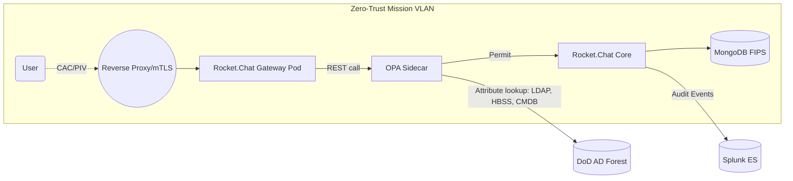

### Where Rocket.Chat Fits in a Zero-Trust Stack

Zero-trust (ZT) doesn’t stop at firewalls and identity providers—your collaboration layer must also **“never trust, always verify.”** Rocket.Chat is one of the few enterprise messaging platforms designed for classified, air-gapped and DoD Impact Level 6 (IL6) environments, so it can be treated as a **mission-critical workload that is itself ZT-aware**. Here’s how it can strengthen (and be strengthened by) a zero-trust architecture.

---

#### 1 ZT Pillar-by-Pillar Contributions

| DoD ZT Pillar                  | Rocket.Chat Capability                                                                                                                    | How to Integrate / Enhance                                                                                                                                                                                      |
| ------------------------------ | ----------------------------------------------------------------------------------------------------------------------------------------- | --------------------------------------------------------------------------------------------------------------------------------------------------------------------------------------------------------------- |
| **Identity**                   | • Native CAC/PIV, SAML 2.0, OIDC & LDAP/AD binding<br>• Per-user MFA (time-based, FIDO2)<br>• Session revocation & anomaly lockout        | • Point Rocket.Chat at your ICAM/ABAC PDP so each login token includes clearance, mission role, device posture, etc.<br>• Disable local accounts; force enterprise IdP + Step-Up auth for “sensitive” channels. |
| **Device**                     | Device tokens for mobile/desktop apps; conditional access plugins                                                                         | • Enrich login JWT with MDM posture; deny chat/file-upload if the device fails STIG baseline.                                                                                                                   |
| **Network / Environment**      | • All traffic TLS 1.3+; optional mTLS between micro-services<br>• Supports micro-segmentation/OOB enclave designs                         | • Place the WebSocket/REST gateway in a Service Mesh; enforce SGT tags from Cisco ISE before allowing channel joins.                                                                                            |
| **Application & Workload**     | • Containerised Helm chart (K8s/Tanzu) with sidecar pattern<br>• API rate-limiting and scope-based tokens                                 | • Attach an Open Policy Agent (OPA) sidecar to evaluate Rego/XACML ABAC rules on every REST call.                                                                                                               |
| **Data**                       | • At-rest encryption with FIPS 140-2 libraries<br>• Optional E2E per-room encryption<br>• Role/attribute-based file & message permissions | • Use channel “stream” hooks to call DLP or Thales CipherTrust for attribute-driven tagging and encryption.                                                                                                     |
| **Visibility & Analytics**     | • Syslog/Audit-event export; message auditing UI<br>• Webhook bus for SIEM/SOAR                                                           | • Feed events to Splunk or Elastic; risk score feeds back into ABAC PDP to throttle or block suspect users.                                                                                                     |
| **Automation & Orchestration** | • REST & WebSocket APIs; bot framework<br>• Marketplace apps signed with ECDSA                                                            | • Automate incident-response rooms: when SOAR flags an IOC, a bot spins up a channel with least-privilege membership pre-validated by attributes.                                                               |

*Sources: Rocket.Chat zero-trust blog series and product pages ([Rocket.Chat][1], [Rocket.Chat][2], [Rocket.Chat][3], [Rocket.Chat][4], [Rocket.Chat][5], [Rocket.Chat][6])*

---

#### 2 Acting as a **Policy-Enforcement Point (PEP)**

Because every user action (post message, upload file, share location) already passes through Rocket.Chat’s REST/WebSocket gateway, you can:

1. **Insert an ABAC decision check**—e.g., call your PDP with `{subject, object, action, env}`.
2. **Deny, permit, or redact** the payload in real time based on clearance, need-to-know, mission phase, geo-fence, or device posture.
3. **Log and sign** the decision for RMF continuous monitoring (SI-4, AU-3).

This turns Rocket.Chat into an application-layer “micro-seg” boundary that complements network-layer segmentation without adding another appliance.

---

#### 3 Deployment Patterns for an Air-Gapped DoD Site



* **Recovery-ready:** All containers are signed, SCAP-scanned, and pulled from an internal registry.
* **No external calls:** Push mobile notifications through an on-prem “push gateway” or disable them entirely.
* **IL6 Provenance:** Official Rocket.Chat hardened images carry a DoD ATO up to IL6, simplifying RMF inheritance for many AC, CM, and SI controls. ([Rocket.Chat][6])

---

#### 4 Example ABAC Policy Snippets

*Rego (OPA) to guard a “Mission-Ops” channel:*

```rego
package chat.allow

default allow := false

allow {
  input.channel == "mission-ops"
  input.action == "post_message"
  input.subject.clearance == "TS"
  input.subject.mission_role == "FlightDirector"
  input.device.compliant == true
}
```

*XACML (abbreviated) to restrict file uploads to PDF only if the user’s device passed last HBSS scan:*

```xml
<Policy>
  <Target>upload</Target>
  <Rule Effect="Permit">
    <Condition>
      <And>
        <AttributeValue DataType="string">pdf</AttributeValue>
        <AttributeDesignator AttributeId="fileType"/>
        <AttributeValue DataType="boolean">true</AttributeValue>
        <AttributeDesignator AttributeId="deviceCompliant"/>
      </And>
    </Condition>
  </Rule>
</Policy>
```

---

#### 5 Benefits in a Zero-Trust Program

* **Eliminates “soft chat room” gaps**—channels inherit the same fine-grained controls as data repositories.
* **Reduces lateral movement risk**—compromised creds alone can’t access sensitive channels without matching attributes.
* **Accelerates ATO renewals**—Rocket.Chat’s existing DoD ATO artifacts let you inherit security controls instead of writing fresh implementation statements.
* **Boosts incident response**—attribute-driven “war rooms” spin up instantly, with automatic kill when incident status = *resolved* (Automation pillar).

---

### Next Steps

1. **Pilot**: Deploy Rocket.Chat in a non-prod enclave; integrate with your ABAC PDP and Cisco ISE SGTs.
2. **Policy Tune**: Begin with read-only attribute evaluations (log only) to measure impact.
3. **Expand**: Gate uploads and E2E-encrypted rooms, then roll out to mission-critical users.

If you’d like deep-dive guidance—STIG checklists, Helm overrides for FIPS modules, or a full ABAC policy catalog—just let me know!

[1]: https://www.rocket.chat/blog/blog-out-of-band-communication?utm_source=chatgpt.com "How out of band communication strengthens zero trust security ..."
[2]: https://www.rocket.chat/?utm_source=chatgpt.com "Rocket.Chat | Secure CommsOS™ for Mission-Critical Operations"
[3]: https://www.rocket.chat/blog/edge-computing-for-mission-critical-communications?utm_source=chatgpt.com "Benefits of edge computing for mission critical communications in ..."
[4]: https://www.rocket.chat/blog/why-digital-sovereignty-is-the-new-national-treasure?utm_source=chatgpt.com "Why digital sovereignty is the new national treasure - Rocket.Chat"
[5]: https://www.rocket.chat/blog/lessons-from-war-plans-group-chat-leak?utm_source=chatgpt.com "Lessons from the U.S. War Plans Leak on Secure Comms"
[6]: https://www.rocket.chat/blog/introducing-rocket-chat-secure-commsos?utm_source=chatgpt.com "Introducing Rocket.Chat Secure CommsOS™ for mission-critical ..."
