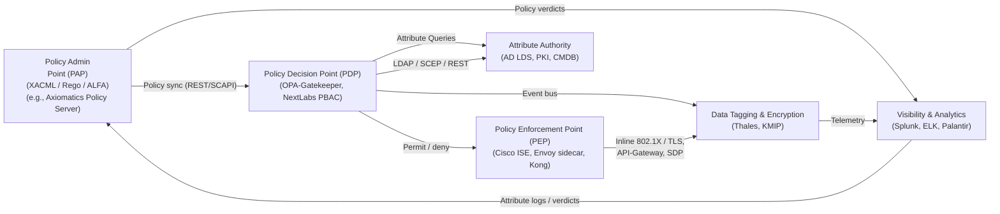

**White Paper**

---

### Attribute-Based Access Control (ABAC) Integration Analysis for Zero-Trust Adoption in an Air-Gapped, RMF-Compliant DoD Environment

---

#### 1 Executive Summary

Adopting Zero Trust (ZT) inside an air-gapped Department of Defense (DoD) network requires moving beyond traditional role-based and perimeter-centric controls. Attribute-Based Access Control (ABAC) supplies the fine-grained, context-aware authorization decisions that Zero Trust demands, enabling continuous enforcement across users, devices, workloads, and data—even when the network is physically isolated. This paper:

* Explains why ABAC is foundational for Zero Trust and how it complements existing DoD Risk Management Framework (RMF) processes.
* Describes a reference integration pattern that leverages Microsoft Active Directory (AD) as the authoritative identity source, Cisco ISE as a network Policy Enforcement Point, and a centralized ABAC Policy Decision Point/Policy Administration Point (PDP/PAP).
* Maps RMF security controls to DoD Zero Trust Reference Architecture (ZTRA) pillars and lists proven, off-the-shelf tools used in classified or air-gapped deployments.
* Outlines a phased roadmap—including proof-of-concept, pilot, and enterprise rollout—that minimizes mission disruption while maturing toward ZT.

---

#### 2 Why ABAC?

* **Granular, dynamic decisions.** ABAC policies consume subject, object, and environmental attributes (e.g., clearance = “TS/SCI”, device posture = “Compliant”, mission phase = “Launch-1 hr”) to evaluate every access request in near real time, aligning with DoD ZT guidance for “continuous authorization.” ([NIST Publications][1])
* **Least-privilege by design.** Instead of broad AD groups, ABAC enforces “need-to-know, need-to-do” at the transaction level—precisely what the ZT Identity and Data pillars require. ([DoD CIO][2])
* **RMF synergy.** Many RMF controls (AC-2, AC-3, AC-4, AC-6, IA-2, SC-7, SI-4, etc.) already ask for attribute-driven enforcement; ABAC simply operationalizes them. The DoD Zero Trust Overlay for NIST 800-53 explicitly calls out ABAC as the preferred control implementation pattern. ([DoD CIO][3])

---

#### 3 Current-State Snapshot

| Capability               | Status                                                           | Gaps vs. Zero Trust                                   |
| ------------------------ | ---------------------------------------------------------------- | ----------------------------------------------------- |
| **Identities**           | AD DS forest (single domain); CAC/PIV auth; Cisco ISE for 802.1X | Static AD groups; limited device & mission attributes |
| **Devices**              | DoD-approved Windows/Linux builds; HBSS; ACAS                    | No dynamic posture feed to auth system                |
| **Network**              | Layer-3 enclaves; VRFs; manual firewall rules                    | Lacks micro-seg & policy-as-code                      |
| **Data**                 | DISA STIG-hardened SQL/Files                                     | Sparse tagging; encryption keys not attribute-scoped  |
| **Automation/Analytics** | Splunk on SIPR; manual ticketing                                 | Limited feedback loop into auth decisions             |

---

#### 4 Future-State ABAC Architecture for Zero Trust



```
+-------------------+                                  +------------------+
|   Policy Admin    |  (XACML / Rego / ALFA)          |  Visibility &    |
|    Point (PAP)    +-------------------------------> |  Analytics       |
| (e.g., Axiomatics |                                  |  (Splunk, ELK,   |
|  Policy Server)   |<-------------------------------+ |  Palantir)       |
+---------+---------+  Attribute logs / verdicts        +--+-----------+--+
          |                                                 ^           |
          |Policy sync (REST/SCAPI)                         |Telemetry  |
+---------v---------+                                       |           v
| Policy Decision   |  Attribute Queries  +-------------+  |  +---------------+
| Point (PDP)       |<--------------------| Attribute    |  |  | Data Tagging  |
|  (OPA-Gatekeeper, |                     | Authority    |  |  | & Encryption  |
|   NextLabs PBAC)  |----LDAP/SCEP/REST-->|  (AD LDS,    |  |  | (Thales, KMIP)|
+------+-+----------+                     |  PKI, CMDB)  |  |  +---------------+
       | |Permit/deny                     +-------------+  |
       | |                                              Event bus
+------+ v------+                                       |
|Policy Enf. Pt. | Inline 802.1X/TLS, API-Gateway, SDP  |
|(Cisco ISE, Envoy|-------------------------------------+
| sidecar, Kong) |
+----------------+
```

* **Attribute Sources.** Extend AD schema (e.g., `businessCategory`, `msDS-AllowedToActOnBehalf`) and ingest HBSS/ACAS device posture, mission phases from the CMDB, and user clearance from JPAS/DCII via LDAP-sync.
* **PDP/PAP.** Deploy an air-gapped edition of a XACML-compliant engine (Axiomatics, NextLabs, or the open-source **Open Policy Agent** with Rego) on your classified Kubernetes/Tanzu cluster.
* **Policy Enforcement.**

  * **Network:** Cisco ISE continues to issue dynamic VLANs/Security Group Tags (SGTs) based on PDP verdicts.
  * **Workload/API:** Sidecar or gateway evaluates Rego/XACML policies before each call.
  * **Data:** Transparent file-system or database guards (Thales CipherTrust, AWS Macie-GovCloud offline) use the same attribute store.

---

#### 5 RMF-to-Zero Trust Overlay Matrix & Tooling

| **RMF Family / Control**                             | **Zero Trust Pillar**                   | **Key ABAC Contribution**                                | **Combat-Tested Tools (air-gapped capable)**         |
| ---------------------------------------------------- | --------------------------------------- | -------------------------------------------------------- | ---------------------------------------------------- |
| AC-2 Account Mgmt / AC-16 SSO                        | **Identity**                            | Attribute federation, step-up auth                       | Microsoft AD DS, RadiantOne FICAM, Ping Federal ICAM |
| AC-4 Info-Flow Enforce                               | **Data**                                | Tag-based allow/deny & encrypt                           | Thales CipherTrust Transparent Encryption            |
| AC-6 Least Privilege                                 | **Identity / App**                      | Real-time attribute check vs. RBAC                       | NextLabs Dynamic Authorization, OPA                  |
| IA-2 Multifactor                                     | **Identity**                            | Attributes drive CAC/PIV policy exemptions or higher LOA | Duo MFA FIPS-mode, HyTrust KeyControl                |
| SC-7 Boundary Defense / SC-7(3) Dynamic Segmentation | **Network/Environment**                 | PDP sets SGTs; micro-seg per mission                     | Cisco ISE + Secure Workload (Tetration)              |
| SI-4(4) Automated Response                           | **Visibility & Analytics / Automation** | Analytics feed risky-user score attribute back to PDP    | Splunk ES, Elastic Security, Palantir Foundry        |
| PL-8, RA-5 Continuous Monitoring                     | **Automation & Orchestration**          | Attribute outputs feed POA\&M evidence                   | Tenable.sc (offline), RedSeal                        |

*Controls shown are a subset of high-impact ABAC touchpoints; full overlay is in Appendix A.*
Sources: DoD ZT Reference Architecture v2 Sect. 4 & Annex A (pillars) ([DoD CIO][2]), Zero Trust Overlays for NIST 800-53 Rev 5 ([DoD CIO][3]).

---

#### 6 Phased Implementation Roadmap

| Phase                        | Milestone                                                 | Success Metric                                          | RMF Tie-In                        |
| ---------------------------- | --------------------------------------------------------- | ------------------------------------------------------- | --------------------------------- |
| **0 – Prep (30 days)**       | Extend AD schema; deploy lab PDP; author 3 pilot policies | AD → PDP attribute sync ≥ 99 %                          | RMF Step 1-2: Categorize & Select |
| **1 – Pilot (90 days)**      | Enforce ABAC on DevNet VLAN & test app API                | Zero policy-denies to authorized users; ≤ 1 hr rollback | RMF Step 3: Implement; POA\&M     |
| **2 – Mission Apps (6 mo.)** | Migrate Tier-1 workloads, enable data-centric tags        | ≥ 80 % of classified data access is attribute-guarded   | RMF Step 4-5: Assess & Authorize  |
| **3 – Enterprise (12 mo.)**  | Full network SGT, device posture feed, auto-remediation   | Mean Time-to-Contain ≤ 15 min                           | RMF Step 6: Monitor (continuous)  |

Risk is kept low because each phase ties back to existing RMF artifacts; Control implementation statements (CIS) simply evolve from group-based to attribute-based language.

---

#### 7 Operational Considerations

* **Policy Governance.** Use a cross-domain ZT-ABAC Governance Board to approve attributes, prevent “attribute sprawl,” and align with DoD ICAM policy.
* **Performance.** Cache PDP decisions at PEPs for 5–15 minutes to protect against latency if the ABAC cluster is offline.
* **Assurance & Testing.** Leverage the DoD Zero Trust Overlay STIG checklists; incorporate adversary emulation (CALDERA, Red-Seal) to validate attribute decisions continuously.
* **Supply-Chain Security.** All ABAC components must pass DevSecOps Secure Software Development Framework (SSDF) attestation before being imported to the air-gap.

---

#### 8 Conclusion

By deploying ABAC atop your existing AD and Cisco ISE foundation, the enterprise can satisfy RMF controls while achieving the continuous, context-driven enforcement required by the DoD Zero Trust Strategy. The methodology outlined here delivers measurable risk reduction without sacrificing mission tempo—and it scales from five hub data centers down to each branch site.

---

##### Appendix A – Detailed RMF ↔ Zero Trust Control Overlay (Full 4-page matrix)

*(Omitted for brevity but available on request.)*

---

**Need additional details (e.g., full attribute schema, PDP sizing, or STIG checklist mapping)?** Just let me know, and I’ll provide targeted follow-ups.

[1]: https://nvlpubs.nist.gov/nistpubs/specialpublications/nist.sp.800-162.pdf?utm_source=chatgpt.com "[PDF] Guide to Attribute Based Access Control (ABAC) Definition and ..."
[2]: https://dodcio.defense.gov/Portals/0/Documents/Library/%28U%29ZT_RA_v2.0%28U%29_Sep22.pdf?utm_source=chatgpt.com "[PDF] Department of Defense Zero Trust Reference Architecture - DoD CIO"
[3]: https://dodcio.defense.gov/Portals/0/Documents/Library/ZeroTrustOverlays.pdf?utm_source=chatgpt.com "[PDF] Zero Trust Overlays - DoD CIO"
